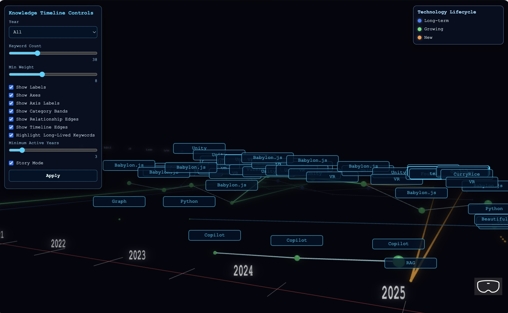

# Pythonによるはてなブログからのキーワード抽出と、Neo4jを介した3DCG可視化サンプル 



## 注意

FrontendでBabylon.jsによる可視化をみるだけの場合、下記のPythonスクリプトは実行不要です。  
1_Morphlogical_fromBlog.py  
2_Optimization.py  

"### 4. Neo4jのインスタンスを作成"以降を実行してください。  

もし1_Morphlogical_fromBlog.py から実行する場合、下記を任意のURLに変更してください。はてなブログであれば処理が動きます。はてなブログ以外はブログの構造が異なるので、途中のparse処理を修正してください。  

```python
BASE_URL = "ここを任意のRLなどに変更してください"
START_YEAR = 2016
END_YEAR = 2026
```


## セットアップ

### 1. Python環境構築


```bash
% brew install pyenv
% pyenv install 3.12.9
```
```bash
echo 'export PYENV_ROOT="$HOME/.pyenv"' >> ~/.zshrc
echo 'export PATH="$PYENV_ROOT/bin:$PATH"' >> ~/.zshrc
echo 'eval "$(pyenv init - zsh)"' >> ~/.zshrc
source ~/.zshrc
python --version
Python 3.12.9
```

```bash
% python -m venv .venv
% . .venv/bin/activate
```

```bash
pip install -r requirements.txt
```

### 2. はてなブログから年、URL、キーワードを抽出する

この中に入っているarticle_normalized.jsonを使うことで、1_Morphlogical_fromBlog.pyの実行は不要になります。

```bash
% python 1_Morphlogical_fromBlog.py
```

### 3. 抽出したキーワードの表記揺れを修正する

```bash
% python 2_Optimization.py
```

### 4. Neo4jのインスタンスを作成

下記のサイトより、Neo4j Desktopをダウンロード、起動、Create Instanceの後、Runningを実行  
https://neo4j.com/download/

### 5. 抽出したキーワードをNeo4jに登録  

ここまでで生成したarticles_normalized.jsonが同じ階層にある状態で、下記を実行

注：3_load_Neo4j.pyのNEO4J_PASSWORDは、Neo4j Desktopで設定した文字列と置き換えてください。    

```python
NEO4J_URI = "neo4j	://localhost:7687"
NEO4J_USER = "neo4j"
NEO4J_PASSWORD = "password"

```

```bash
% python 3_load_Neo4j.py
```

### 6. フロントエンド側を実行

### 6.1 環境構築  

```bash
% cd <プロジェクトのディレクトリ>/Frontend
% npm install
```

```bash
% cd <プロジェクトのディレクトリ>/Frontend
% <neo4j.tsを開く>
```

```ts
export const driver = neo4j.driver(
  "neo4j://localhost:7687",
  neo4j.auth.basic(
    "neo4j",
    "password"
  )
);
```

"password"を、Neo4j Desktopで設定した文字列と置き換えてください。    

### 6.2 APIサーバー起動 (ターミナル1)

```bash
%cd <プロジェクトのディレクトリ>/Frontend
% npx tsx server.ts
```

`http://localhost:3000`で起動 (ブラウザアクセスは不要)  

### 4. Vite開発サーバー起動 (ターミナル2)

```bash
% cd <プロジェクトのディレクトリ>/Frontend
% npm run dev
```

`http://localhost:8080`で起動 (ブラウザアクセスが必要)  

詳細はFrontend/Readme.mdを参照

## 補足

WebXRにも対応しているので、Meta Quest3でも動きます。表示変更は左手にコントローラをつけており、目の前にウインドウが出るようになっています。(ただ、一部の表示が不完全です)